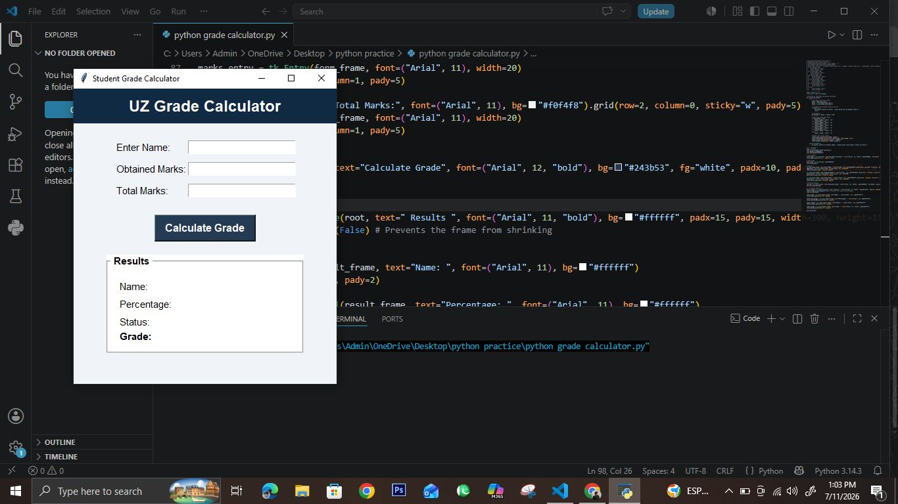
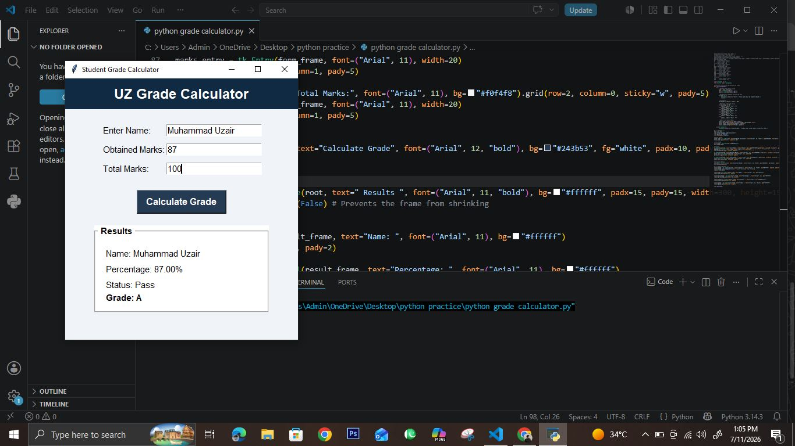

<div align="center">

# 🎓 UZ Grade Calculator

### A sleek, desktop grade calculator built with Python &amp; Tkinter

*Enter your marks. Get your percentage, grade, and pass/fail status — instantly.*


</div>

---

## 📋 Table of Contents

- [Overview](#-overview)
- [Application Preview](#-application-preview)
- [Features](#-features)
- [Tech Stack](#-tech-stack)
- [Grade Criteria](#-grade-criteria)
- [How It Works](#-how-it-works)
- [Installation](#-installation)
- [Usage](#-usage)
- [Project Structure](#-project-structure)
- [Future Improvements](#-future-improvements)
- [Contributing](#-contributing)
- [License](#-license)
- [Author](#-author)
- [Support](#-support)

---

## 📖 Overview

**UZ Grade Calculator** is a modern desktop application built with **Python** and **Tkinter** that helps students calculate their academic performance quickly and accurately.

Simply enter your name, obtained marks, and total marks — the app instantly computes your **percentage**, assigns a **letter grade**, and determines your **pass/fail status**, all through a clean, intuitive, and responsive graphical interface.

Whether you're a student tracking your semester results or just need a quick and reliable grade lookup tool, UZ Grade Calculator gets the job done with zero friction.

---

## 📸 Application Preview

**Main Interface**



**Calculation Result**



---

## ✨ Features

- 🖥️ **Modern Graphical User Interface (GUI)** — clean and user-friendly design
- 📊 **Automatic Percentage Calculation** — instant, accurate results
- 🏆 **Grade Assignment** — supports A+, A, B, C, D, and F grading scale
- ✅ **Pass / Fail Status Detection** — know your result at a glance
- 🛡️ **Input Validation** — robust error handling for invalid entries
- ⚡ **Fast & Accurate Calculations** — no lag, no guesswork
- 🔄 **Clear / Reset Functionality** — reset all fields with one click
- 🚪 **Exit Button** — close the app conveniently
- 📐 **Responsive Layout** — adapts cleanly to the window

---

## 🛠 Tech Stack


| Technology | Purpose |
|------------|---------|
| **Python** | Core application logic |
| **Tkinter** | Graphical user interface (GUI) |

---

## 📊 Grade Criteria

| Percentage     | Grade | Status |
|----------------|:-----:|:------:|
| 90% – 100%     | A+    | ✅ Pass |
| 80% – 89%      | A     | ✅ Pass |
| 70% – 79%      | B     | ✅ Pass |
| 60% – 69%      | C     | ✅ Pass |
| 50% – 59%      | D     | ✅ Pass |
| Below 50%      | F     | ❌ Fail |

---

## ⚙ How It Works

1. Enter your **name**
2. Enter your **obtained marks**
3. Enter your **total marks**
4. Click **Calculate**
5. Instantly view your:
   - 📊 Percentage
   - 🏆 Grade
   - ✅❌ Pass/Fail Status
6. Click **Clear** to reset all fields
7. Click **Exit** to close the application

---

## 💻 Installation

### Prerequisites

- Python 3.x installed on your system
- Tkinter (included with most standard Python installations)

### Steps

```bash
# 1. Clone the repository
git clone https://github.com/muhammaduzairmoeed-byte/uz-grade-calculator.git

# 2. Navigate into the project directory
cd uz-grade-calculator

# 3. Run the application
python main.py
```

---

## 🚀 Usage

Once launched, the application window will open with input fields for your **name**, **obtained marks**, and **total marks**.

```bash
python main.py
```

1. Fill in the required fields
2. Click **Calculate** to view your percentage, grade, and status
3. Use **Clear** to start over or **Exit** to close the app

---

## 📂 Project Structure

```
uz-grade-calculator/
├── main.py          # Application entry point & core logic
└── README.md         # Project documentation
```

---

## 🔮 Future Improvements

- 📁 Export results to PDF or CSV
- 🎨 Add theme/dark mode support
- 📈 Store and track grade history across sessions
- 🌐 Multi-subject / GPA calculation support
- 🧪 Add unit tests for calculation logic

---

## 🤝 Contributing

Contributions are welcome and appreciated! To contribute:

1. **Fork** the repository
2. **Create** a new branch (`git checkout -b feature/your-feature`)
3. **Commit** your changes (`git commit -m 'Add some feature'`)
4. **Push** to the branch (`git push origin feature/your-feature`)
5. **Open** a Pull Request

Feel free to open an [issue](../../issues) for bugs, suggestions, or feature requests.

---

## 📄 License

This project is licensed under the **MIT License** — you're free to use, modify, and distribute it with attribution.

See the [LICENSE](LICENSE) file for full details.

---

## 👨‍💻 Author

**Muhammad Uzair**

🎓 BS Artificial Intelligence Student
💻 Python | C++ | Artificial Intelligence
🌱 Passionate about AI, Machine Learning, and Software Development

[](https://github.com/muhammaduzairmoeed-byte/uz-grade-calculator)
[](https://www.linkedin.com/in/muhammaduzair-ai/)

---

## ⭐ Support

If you found this project useful, please consider giving it a **star** ⭐ on GitHub — it helps a lot and motivates further development!

<div align="center">

**Made with ❤️ and Python by Muhammad Uzair**

</div>
